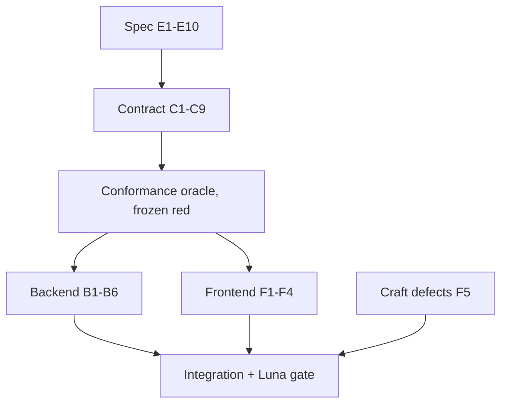

# DRAFT — spec and contract change plan

**Status:** draft for review. Nothing applied. `PAPERCLIPS.md`, `contract/`,
`conformance/`, and source are all untouched by this document.
**Date:** 2026-08-12.
**Implements decisions D1–D5 from** [contract review](/contract/completeness-and-lifecycle-review).
**Supersedes** the five-line implementation path in that review with concrete
edits.

## How to review this

Check four things, in this order:

1. **Is E3 correct?** The whole plan rests on the claim that PAPERCLIPS.md §6
   already mandates this data model and merely under-specifies it. If that claim
   is wrong, most of the plan is mis-framed.
2. **Are the proposed wordings precise enough to implement without interpretation?**
   Each edit gives verbatim current text and verbatim proposed text.
3. **Does the conformance oracle actually pin the behavior**, or could an
   implementation pass it while still failing the intent?
4. **Are the acceptance commands runnable from the repository root as written?**

Open questions are collected at the end; they are genuine, not rhetorical.

## Framing: this is mostly enforcement, not invention

PAPERCLIPS.md §6 line 165 already states the data model:

> **no nulls** — empty string / empty array / explicit booleans

And §7.1 line 175 already states the lifecycle surface:

> Deletion of entities is `POST /api/characters/{id}/delete` guarded by
> `confirm: true`.

So the canonical-empty model and entity deletion are already the spec's intent.
What the spec never says:

- that **every declared key is always present** — absence was left undefined, so
  implementations used it to mean empty, and readers treated it as corruption;
- what **complete** means for a sheet, so nothing could distinguish a legitimate
  empty (`tier: 0`, `crewId: ""`) from an outstanding one (`dossier.name: ""`);
- that a client **must surface** the operations and clamps the contract defines.

Three genuinely new rules; the rest is making the spec say what it already meant.
This also means **§6 byte-identity is preserved unchanged** — the earlier
response-normalization proposal is withdrawn.

## Part 1 — proposed PAPERCLIPS.md edits

### E1 — §4 Persistence: new rule 6, canonical shape

Insert after item 5 (`formatVersion`).

**Proposed:**

> 6. **Canonical shape**: every key declared in an entity's schema is present in
>    its stored document; unset values use the canonical empties of §6. The
>    server guarantees this at the **write boundary** — create, import, and every
>    operation that writes a nested object — so no client can persist a partial
>    document. A stored document in non-canonical shape is **rejected**, never
>    silently repaired and never written to: reads stay pure, and the write
>    boundary is the only place the shape is established.

**Rationale:** the invariant must live in the backend, not the frontend. An AI
agent posting directly to `/api` is a first-class client (§1); if gap-filling were
a frontend duty, any agent omitting a field would persist a broken document.

### E2 — §4.5 formatVersion: clarify against conflation

**Current:**

> 5. **formatVersion**: integer, starts at 1, with a migration pipeline that
>    exists (and is tested) from day one even while empty. It versions the
>    persistence format, not the game edition. (Resolves REVIEW #6.)

**Proposed:** append to that item:

> Canonicalisation on write (rule 6) is **not** a migration and never changes
> `formatVersion`; the pipeline stays empty until the format itself changes.

**Rationale:** without this, a future agent will implement canonicalisation
as a version bump — which is what the earlier plan wrongly proposed.

### E3 — §6 line 165: state key presence

**Current:**

> - camelCase keys; dictionaries keyed by name (`abilitiesByName`,
>   `availableGearByName`); type discriminators as `"kind"`; **no nulls** — empty
>   string / empty array / explicit booleans; `revision` and `formatVersion` on
>   every entity; ISO-8601 UTC timestamps.

**Proposed:**

> - camelCase keys; dictionaries keyed by name (`abilitiesByName`,
>   `availableGearByName`); type discriminators as `"kind"`; **no nulls and no
>   absent keys** — every declared key is always present, and unset values are
>   empty string / empty array / zero / explicit booleans. Absence is never used
>   to mean empty. `revision` and `formatVersion` on every entity; ISO-8601 UTC
>   timestamps.

### E4 — §6: new bullet defining completeness

Insert after the byte-identity bullet (line 166).

**Proposed:**

> - **Completeness is data, not validity.** A schema declares
>   `x-requiredWhenComplete`: the JSON pointers that must hold a non-empty value
>   for a sheet to count as finished. Entities therefore have three states:
>   **complete** (every such pointer filled), **incomplete** (a normal, openable,
>   editable sheet — a draft), and **unreadable** (unparseable bytes, non-object
>   root, wrong `kind`, or an undeclared key). Only *unreadable* is an error;
>   incomplete entities support every operation. An empty value cannot be
>   classified by inspection — `tier: 0` and `dossier.crewId: ""` are legitimate
>   values — so `x-requiredWhenComplete` is the single source of that judgment for
>   every client. Being static schema data, it never appears in a response body
>   and does not affect byte-identity. Retirement is orthogonal: a retired or
>   deadish character reports outstanding fields exactly like any other, because
>   completeness describes the record rather than the character's fate.

### E5 — §7.1: new bullet, published limits

**Proposed:**

> - **No client computes an enforced limit.** Every bound the server enforces is
>   present in the DTO it constrains. Where a settings maximum and a
>   situation-dependent effective maximum differ (e.g. a Mastery-gated action
>   rating), publish both. Values continue to come from game settings (§5) and are
>   never hardcoded. An agent must never have to infer a cap or discover it by
>   rejection.

### E6 — §7.1: new bullet, delta semantics and clamp reporting

**Proposed:**

> - **Numeric operations declare their semantics.** Every `*.add` states whether
>   it takes a signed delta or an absolute value and whether negative deltas are
>   accepted; clock operations additionally state rollover carry-over behavior.
>   `applied.requested` and `applied.effective` are always populated, and when
>   they differ both clients MUST tell the user the value was clamped.

### E7 — §7.1 line 190: typed error detail

**Current:**

> - Errors: typed codes (`STALE_REVISION`, `NOT_FOUND`, `RETIRED`, `VALIDATION`,
>   `ARMOR_NOT_AVAILABLE`, `SLOT_FULL_FATAL`, `CONFIRM_REQUIRED`, …), enumerated
>   in the contract.

**Proposed:**

> - Errors: typed codes (`STALE_REVISION`, `NOT_FOUND`, `RETIRED`, `VALIDATION`,
>   `INVALID_ENTITY`, `ARMOR_NOT_AVAILABLE`, `SLOT_FULL_FATAL`,
>   `CONFIRM_REQUIRED`, …), enumerated in the contract. `error.details` is typed
>   per code so a failure is machine-actionable — `VALIDATION` carries the
>   offending pointer and the expected shape, a `*_MAXED` code carries the limit
>   and current value — and `error.retryable` states whether retrying can
>   succeed. `error.message` is presentable to a human verbatim; no client ever
>   renders the raw result document.

### E8 — §4.2: `If-Match` required for destructive operations

**Current:**

> Mutating requests MAY send `If-Match: <revision>`; a mismatch returns
> `409 CONFLICT` with error code `STALE_REVISION` and the current revision.

**Proposed:**

> Mutating requests MAY send `If-Match: <revision>`, and **undo, delete, and
> import MUST send it**; a mismatch returns `409 CONFLICT` with error code
> `STALE_REVISION` and the current revision.

**Rationale:** these three are the operations whose blind execution destroys work
a concurrent client has already committed.

### E9 — §12: new paragraph, client obligations

Insert after the opening paragraph (line 253).

**Proposed:**

> **Client obligations.** Every destructive or lifecycle operation the contract
> defines must be reachable in the human UI behind an explicit confirmation, and
> discoverable by an agent — deletion and retirement included. Outstanding fields
> are rendered from `x-requiredWhenComplete` rather than from any client-local
> notion of missing data, and a clamped value is always announced. The UI must
> open an incomplete sheet normally and let the user finish it.

### E10 — §8: conformance additions

**Current:**

> - `fixtures/` — golden character/crew JSON documents both backends must emit
>   byte-identically.

**Proposed:**

> - `fixtures/` — golden character/crew JSON documents both backends must emit
>   byte-identically; every golden document is in canonical shape (§4.6).
> - `suites/parity/` — capability parity: every operation in the contract has a
>   client path or a recorded exemption. Absent features are invisible to
>   suites that enumerate only what exists.

### E11 — §7.1: new bullet, collection endpoints are total

**Proposed:**

> - **Collection endpoints never fail because of one member.** Roster and list
>   responses always return `200`, and a member the server cannot read is still
>   listed — as a row with the same keys as every other row, carrying its `id`,
>   `kind`, `isReadable: false`, and canonical empties elsewhere. Row shape stays
>   uniform, so no client has to branch on a polymorphic summary. A record the
>   server cannot read must remain visible and deletable; hiding it would make it
>   unreachable and therefore unremovable.

## Part 2 — proposed contract changes

Contract and conformance edits are one dedicated change, frozen before any
implementation, per the project rule.

| Id | File | Change |
|---|---|---|
| **C1** | `schemas/character.json`, `crew.json`, `clock.json` | add `x-requiredWhenComplete` pointer lists |
| **C2** | `schemas/crew.json` ↔ backend | no schema change; backend's `Crew_Required` is missing `claimedClaimIds`/`claimOverrides`, which the schema already requires |
| **C3** | `schemas/common.json` | add `INVALID_ENTITY` to `errorCode` |
| **C4** | `schemas/operation-result.json` | type `error.details` as a union discriminated by `code`; add `error.retryable` |
| **C5** | `openapi.yaml` | declare `422` on operations that load persisted state; map `INVALID_ENTITY` → 422 in the `OpResult` description; mark `ifMatch` required on undo/delete/import |
| **C6** | `schemas/character.json`, `crew.json` | publish effective limits as **new** fields beside the settings maxima. The action DTO currently requires `rating` and `maxRating` (integer, min 1) — add `effectiveMaxRating` rather than redefining `maxRating`. An upgrade entry currently requires only `name` and `boxesMarked` — add `totalBoxes`. Both derive from game settings and crew state, never hardcoded |
| **C7** | `schemas/campaign.json` | add `isComplete` and `isReadable` to roster summary rows, keeping the row shape total (same keys always, canonical empties when unreadable). Both are **derived at response time, never stored** — a persisted flag would go stale. Summaries are derived DTOs, so byte-identity is unaffected |
| **C8** | `openapi.yaml` | state delta-vs-absolute and negative-delta acceptance per numeric op; state rollover carry-over |
| **C9** | `openapi.yaml` `dossier.update` | point the vice property at `$defs.vice` instead of `$defs.namedDescription` (closes FV-026) |

## Part 3 — conformance oracle

Frozen first, red against current code. Proposed file and test names; workers must
preserve the names.

**`suites/persistence/canonical-shape.test.ts`**

- `create writes every declared key in canonical shape`
- `import canonicalises before writing`
- `every mutation rewrites the whole canonical shape`
- `nested-object write fills its own canonical empties`
- `canonicalisation never changes formatVersion`
- `GET stays byte-identical to the stored document`
- `no read path writes to disk`

**`suites/persistence/entity-admission.test.ts`**

- `undeclared top-level key yields 422 INVALID_ENTITY`
- `unparseable document yields 422 INVALID_ENTITY without writing`
- `wrong kind for the route yields 422 INVALID_ENTITY`
- `admission failure leaves the stored bytes untouched`
- `roster lists an unreadable member with isReadable false and retains valid rows`
- `an unreadable member can be deleted`

**`suites/semantics/completeness.test.ts`**

- `entity missing an x-requiredWhenComplete pointer is operable`
- `legitimate empties are not treated as outstanding`
- `roster summary reports isComplete`

**`suites/semantics/published-limits.test.ts`**

- `action DTO publishes the effective rating cap`
- `set-rating and levelup enforce the same published cap`
- `upgrade.mark enforces published totalBoxes then UPGRADE_MAXED`
- `signed delta subtracts and clamps at zero`
- `rollover clock accumulates carry-over`
- `clamped operation reports requested and effective`

**`suites/contract/error-detail.test.ts`**

- `VALIDATION carries pointer and expected shape`
- `maxed codes carry limit and current`
- `every error carries retryable`

**`suites/parity/capability-parity.test.ts`**

- `every contract operation has a client path or a recorded exemption`

## Part 4 — implementation work

**Backend**

- **B1** write-boundary canonicalisation: `New_Character`, `New_Crew`, import, and
  nested-object writes.
- **B2** admission check in `Read_Entity` — reject non-canonical documents, never
  repair them; extend `Crew_Required` with `claimedClaimIds`/`claimOverrides`; add
  `Character_Allowed`/`Crew_Allowed` and an undeclared-key check.
- **B3** published limits: unify `Rating_Cap` across `action.set-rating` and
  `attribute.levelup`; enforce `TotalBoxes` in `upgrade.mark`; accept signed
  deltas in the XP operations via the existing `Core_Clamp_Subtract`.
- **B4** rollover carry-over accumulation in `Paperclips_Core.Clocks.Progress`
  (proof obligation — state the `Post` first).
- **B5** typed `error.details` and `retryable`.
- **B6** roster projection isolation: one unreadable entity cannot take the
  collection down, and its row stays listed and deletable.

**Frontend**

- **F1** tolerant decode: accept canonical empties, keep rejecting undeclared keys.
- **F2** outstanding-field styling driven by `x-requiredWhenComplete`.
- **F3** delete and retire UI with confirmation and `If-Match`.
- **F4** clamp notices; friendly typed errors; no raw result documents.
- **F5** the ten craft defects already carded in the fix-wave plan.

## Part 5 — sequencing



Spec first because it is the source of truth. The oracle is frozen before any
implementation. Backend and frontend then proceed in parallel against the frozen
contract. `F5` has no dependency on the spec change and can start immediately.

## Part 6 — acceptance commands

Runnable from the repository root; each directory change is isolated so no leg can
move the next leg's working directory. `<PORT>` is the task's isolated server.

```sh
# canonical shape and admission
(cd backend-ada/server && env XDG_RUNTIME_DIR=/tmp alr --non-interactive build) && (cd conformance && env BASE_URL=http://127.0.0.1:<PORT> npm test -- --run suites/persistence/canonical-shape.test.ts suites/persistence/entity-admission.test.ts)

# completeness, limits, error detail, parity
(cd conformance && env BASE_URL=http://127.0.0.1:<PORT> npm test -- --run suites/semantics/completeness.test.ts suites/semantics/published-limits.test.ts suites/contract/error-detail.test.ts suites/parity/capability-parity.test.ts)

# core proof for the clock change
(cd backend-ada/core && env XDG_RUNTIME_DIR=/tmp alr exec -- gnatprove -u paperclips_core-clocks.ads --level=2 --checks-as-errors=on && env XDG_RUNTIME_DIR=/tmp alr exec -- gprbuild -p -P core_tests.gpr && ./bin/core_tests)

# frontend
(cd frontend && npm test -- --run && npm run build)

# full gates
./backend-ada/ci.sh
env RUN_CONFORMANCE=1 ./backend-ada/ci.sh
```

Frontend visual work additionally requires the GPT 5.6 Luna multimodal `VERDICT:
PASS` gate per `AGENTS.md`.

## Part 7 — effect on the 32 confirmed findings

| Findings | Closed by |
|---|---|
| FV-001, FV-002, FV-003, FV-009 | E1, E3, B1, B2 — legacy records become drafts |
| FV-010 | E4, B6 — roster isolation plus operable incomplete entities |
| FV-017, FV-018 | E4, E9, F2 — drafts are resumable and labelled |
| FV-026 | C9 |
| FV-027 | E4, C3, C5, B2, F1 — narrowed to undeclared keys and unreadable bytes |
| FV-004 | B2 (`Crew_Required`) and the already-correct cohort contract |
| FV-005, FV-021, FV-022 | E5, C6, B3 |
| FV-006, FV-007, FV-011, FV-029 | E6, C8, B3, B4, F4 |
| FV-020, FV-023, FV-024 | E7, C4, B5, F4 |
| FV-019 | E8, C5, F3 |
| FV-028 | E9, F4 |
| FV-008, FV-012–016, FV-025, FV-030–032 | unchanged fix-wave craft cards (F5) |

Also closed, though never logged as findings: absent character/crew delete UI and
absent retirement UI (E9, F3, capability parity).

## Part 8 — explicitly out of scope

- No format-version bump, and no migration engine (D1, D2).
- No relaxation of §6 byte-identity; the earlier proposal is withdrawn.
- No nullable types; canonical empties already cover it.
- No recursive JSON-Schema validator in the backend. Nested type, enum, pattern,
  and bound violations remain uncertified server-side and stay listed as residual
  risk; the frontend decoder is the recursive check.
- Retired-character memorial: deferred, see [Roadmap](/roadmap).

## Decisions and open questions

1. **DECIDED — `INVALID_ENTITY` is `422`.** The request is valid and the resource
   exists, so `400` and `404` are both untrue. `500` was drafted first but
   rejected: the server is functioning correctly and reporting a precise,
   actionable fact about stored content, which is exactly what `422 Unprocessable
   Content` describes. `422` also keeps the case out of generic 5xx alerting.
2. **DECIDED — normalise on write only; no repair path at all.** The write
   boundary establishes canonical shape, reads stay pure, and a stored document
   that never passed through the write boundary is rejected with `422`. See the
   discussion below for why the read-repair and startup-sweep options were both
   dropped.
3. **RESOLVED (evidence) — `x-requiredWhenComplete` belongs in the schema.**
   Checked `data/games/blades-in-the-dark.json` against
   `data/games/scum-and-villainy.json`: both define `Vices`, `Heritages`,
   `Backgrounds`, and `Traumas`, so the *field set* is identical across supported
   games and only the option lists differ. `purveyor` appears in neither settings
   file — it is free text, not a settings-driven choice. The required-field list
   is therefore a property of the format, not of the game. Revisit only if a
   future game drops one of these fields entirely.
4. **DECIDED — retirement does not exempt an entity from completeness.** A
   retired or dead character reports outstanding fields exactly like any other.
   Completeness describes the record, not the character's fate, and a memorial
   (see [Roadmap](/roadmap)) reads better with complete sheets.
5. **DECIDED — keep `x-requiredWhenComplete`.** Consistent with the existing
   `x-snapshot`, and the conformance suite closes the enforcement gap that `x-`
   leaves. A companion strict schema can be generated from the pointer list later
   without changing any client, so nothing is foreclosed.

### Discussion — Q2, where does normalisation happen?

Normalising on write is not an alternative to the write boundary; it *is* the
write boundary, and it was always the primary mechanism (E1). Every create,
import, and mutation writes the complete canonical shape, so any document the API
produces is canonical by construction. Nothing further is needed for data the app
creates.

That leaves exactly one narrow case: a document that never passed through the
write boundary — written before the rule existed, or dropped on disk by hand.
Normalise-on-write cannot reach those, because nothing is writing them.

Four candidates for that residue:

| Option | Reads stay pure | Unreachable entity risk | Cost |
|---|---|---|---|
| **A** repair on first read | no | none | interrupted-repair debris |
| **B** refuse until an explicit repair operation | yes | yes | an extra operation and UI |
| **C** sweep the data directory at startup | yes | none | boot cost, plus repair code to test |
| **D** write boundary only; reject the residue | yes | none, given D1 and a visible row | none |

**Decided: D.** Since stored data is disposable (D1), auto-healing pre-existing
documents buys nothing, and every repair mechanism is code that must be written,
tested, and kept correct for a case that should never recur. Rejecting with `422`
is honest: such a document did not come from this API.

D is only safe with one guarantee, which is why **E11** exists: an unreadable
record must stay **visible in the roster and deletable**. Omitting it — the
earlier O-ROSTER position — would hide the file, and a hidden record cannot be
removed, which recreates exactly the broken-and-unremovable trap this whole
review set out to fix. Listed-but-degraded plus a working delete closes it.

A second clarification: completeness is **derived, never stored**. Marking a sheet
incomplete at write time would persist a flag that goes stale the moment a
different operation fills the last outstanding field. The server computes it from
`x-requiredWhenComplete` at response time (C7).

### Discussion — Q5, custom keyword or companion schema?

In JSON Schema and OpenAPI, an `x-` prefix marks a vendor extension: tools ignore
what they do not recognise. That is correct for decorative metadata, and the
contract already uses `x-snapshot` that way. The concern is that
`x-requiredWhenComplete` is not decorative — it is a rule both clients must obey,
and a validator that skips it fails silently. Completeness reporting would simply
stop working, and everything would look fine.

The alternative is to express completeness as a second, stricter schema —
`character.complete.json` extending the storage schema with `minLength: 1` on the
fields that must be filled. Then "is this sheet complete?" becomes "does it
validate against the complete schema?", answerable by any standard validator,
including one an agent runs locally with no bespoke logic.

| Option | Tooling-enforceable | Drift risk | Cost |
|---|---|---|---|
| `x-requiredWhenComplete` | no; needs the conformance test as backstop | low, single list | minimal |
| companion strict schema | yes, any validator | two files to keep aligned unless generated | one extra schema per entity type |

**Decided: keep `x-requiredWhenComplete`.** It is consistent with `x-snapshot`,
the conformance suite already closes the enforcement gap, and the companion schema
can be *generated* from the pointer list later without changing any client — so
the more rigorous option stays available rather than being foreclosed. A reviewer
who thinks the generated schema should land immediately should say so.
