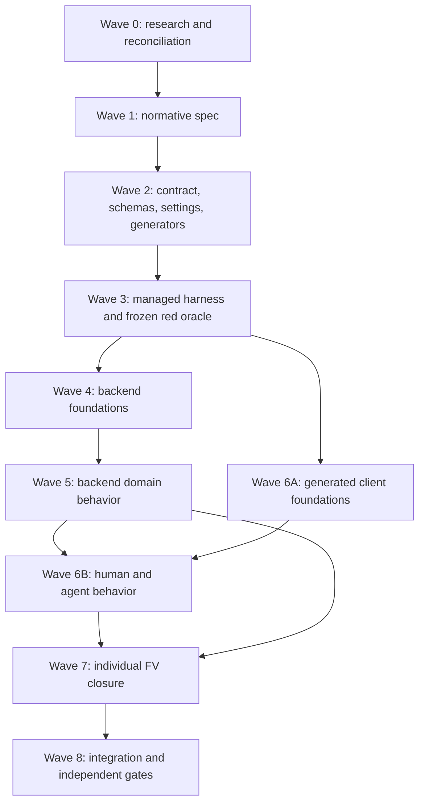

# Ordered work specification — canonical data, lifecycle, limits, and finding closure

**Status:** approved direction, work not started. This is a living execution specification.
**Date:** 2026-08-14.
**Supersedes for execution:** [DRAFT — spec and contract change plan](/contract/spec-change-draft).
**Decision provenance:** the contract review, review findings on the draft, and the human answer sheet recorded 2026-08-14. This page is self-contained; workers must not depend on the gitignored answer sheet.

## Purpose

Apply the complete contract correction without conflating it with implementation or claiming that broad architectural work automatically closes a concrete defect. Work proceeds in ordered waves:

1. resolve bounded research questions and freeze exact semantics;
2. change the normative specification;
3. change the contract, schemas, settings, generators, and client manifests;
4. freeze a red conformance oracle against the changed contract;
5. implement backend infrastructure and domain behavior;
6. implement human and agent clients;
7. close every confirmed frontend finding individually;
8. run integration, browser, proof, documentation, and independent review gates.

The plan preserves all 32 findings in `agent-docs/frontend-vetting/BUGS.json`. Splitting the work is sequencing, not scope reduction.

## Authority and change control

Authority, highest first:

1. `PAPERCLIPS.md` after Wave 1 lands;
2. `contract/openapi.yaml` and `contract/schemas/` after Wave 2 lands;
3. the frozen conformance oracle after Wave 3 lands;
4. this work specification for sequencing and task ownership;
5. the superseded draft and prior review as rationale only.

The C# `blades-in-the-sheets/Models/` source remains authoritative for existing domain semantics. Public Blades material may establish terminology and intended lifecycle behavior where the reference has no model, but workers never edit the reference tree.

Only the dedicated specification/contract/oracle tasks may edit `PAPERCLIPS.md`, `contract/`, or `conformance/`. Backend and frontend implementation workers consume the frozen oracle and must not change it.

When a decision below changes, the orchestrator must update, in the same change:

- the decision ledger;
- affected task dependencies and acceptance criteria;
- the normative spec/contract if already frozen;
- the traceability ledger;
- the dated `## Change log` entry.

No decision may live only in chat or orchestrator memory.

## Locked product and technical decisions

### Canonical shape and normalization

1. **Canonical presence is a new version-1 contract rule.** Version 1 is redefined in place because the product is pre-release; there is no format-version bump.
2. **Readable entities are total.** Every property declared for an ordinary entity object is present in storage. `null` is never stored. Missing or `null` values normalize to a schema-valid canonical default.
3. **Sparse overlays remain sparse.** The outer `claimOverrides` array is always present. Each override item always has `claimId`; omitted `name`, `description`, or `effects` means “inherit the canonical game-setting value.” Present empty arrays remain semantically distinct from omitted arrays.
4. **Crew `contacts` and `factions` become required canonical arrays.** Empty means no entries.
5. **Normalization never invents silently.** The canonicalizer returns an ordered change list with JSON pointer, reason, previous classification, and replacement. Known legacy conversions, such as one notes string to a one-entry notes array, are explicit rules.
6. **Unknown or semantically constrained values are not guessed.** If a schema-valid value cannot be derived—for example, a standalone clock has no usable positive size—the repair requires caller-supplied input.
7. **Reads remain pure and byte-identical.** A normal GET never changes storage and returns the canonical stored document byte-identically.
8. **Existing non-canonical data uses explicit repair, not read repair.** A repair preview computes the normalized result and warnings without writing. Apply requires confirmation and an opaque content token, then atomically writes the previewed result. Unparseable bytes remain degraded and cannot be normalized.
9. **Partial import is supported through preview/apply.** Preview accepts a partial document, shows every fill, conversion, correction, and data-dropping action, and does not write. Apply requires `If-Match`, confirmation, and the preview token. Unknown properties are rejected unless the preview explicitly classifies and displays their removal; no unnoticed property drop is allowed.
10. **API writes are canonical by construction.** Create, successful import, repair, and every mutation writing a nested object persist the complete canonical shape.

The normalizer has four outcomes:

- `canonical`: readable without changes;
- `repairable`: a schema-valid canonical result can be produced and previewed;
- `needs-input`: the preview identifies exact pointers that require caller values;
- `unreadable`: bytes cannot be parsed as a recoverable entity object.

### Completeness

Completeness is derived, never stored. It is separate from structural validity.

`x-requiredWhenComplete` is an array of records, each containing a JSON pointer and a predicate from a small contract-defined vocabulary. The initial vocabulary is:

- `nonBlankString`: at least one non-whitespace character;
- `nonEmptyArray`: at least one entry;
- `positiveInteger`: integer greater than zero;
- `true`: boolean true.

Only `nonBlankString` is needed by the initial field set. New predicates require a contract change and conformance cases.

Initial character completeness fields:

- `/dossier/name`;
- `/dossier/alias`;
- `/dossier/look`;
- `/dossier/heritage/name`;
- `/dossier/background/name`;
- `/dossier/vice/name`;
- `/dossier/vice/purveyor/name`;
- `/playbook/name`.

Initial crew completeness fields:

- `/name`;
- `/crewTypeName`;
- `/lair`;
- `/reputation`;
- `/huntingGrounds`.

Standalone clocks have no completeness list: successful creation already requires their identifying configuration. They still participate fully in canonical shape, recursive admission, import, repair, deletion, and total collection behavior.

A present canonical empty at one of these pointers makes an entity incomplete and operable. An absent canonical property makes it non-canonical and routes it through repair/degraded handling. Retirement and deadish state do not change completeness; retired characters permit the non-mechanical dossier edits needed to finish their record.

### Degraded entities, collections, repair, and deletion

Every collection endpoint is total: one bad member never removes valid rows or changes the response from `200`.

Every summary row has the same schema and includes:

- route-derived `id` and `kind`;
- canonical empty summary values where source data cannot be read;
- `isReadable`;
- `isRepairable`;
- `isComplete` when readable, otherwise false;
- a `deleteToken` usable as the unreadable member’s `If-Match` value.

Directory location is authoritative for degraded-row identity. A record stored under `characters/{id}` is listed as character `{id}` even when its body claims another identity or cannot be parsed.

For a readable entity, destructive operations continue to use its revision. For a degraded entity, `deleteToken` is an opaque token bound to the current raw bytes, represented as `sha256:<lowercase hex>`. Deleting or repairing after the bytes change returns `409 STALE_REVISION` rather than acting on unseen data.

Deleting an unreadable crew scans readable characters and atomically clears every matching `dossier.crewId` before removing the crew. Unreadable characters do not prevent deletion but remain separately visible.

### Stored-entity classification and HTTP errors

Wave 0 produces the exhaustive classification table, but these outcomes are fixed:

- Invalid inbound request syntax or shape: `400 VALIDATION`.
- Submitted import/repair content that cannot be normalized with the supplied values: `400 INVALID_ENTRY` with pointer-level details.
- A parseable stored entity requiring explicit repair: direct access returns `422 INVALID_ENTITY` with repairability details; collections remain `200`.
- Unparseable stored bytes: direct access returns `422 INVALID_ENTITY`; collections remain `200` and deletion remains available.
- A normalization preview requiring confirmation before a lossy or material rewrite: `409 NORMALIZATION_REQUIRED` with warnings and preview token.
- Missing path: `404 NOT_FOUND`.
- Changed revision or degraded content token: `409 STALE_REVISION`.

`INVALID_ENTRY` is about caller-supplied content. `INVALID_ENTITY` is about persisted content. This distinction preserves meaningful HTTP semantics while honoring normalization-first behavior.

The operation error schema is one discriminated union over the whole error object. Every code declares:

- HTTP status;
- required detail shape;
- recovery instruction;
- whether the same semantic operation may succeed after that instruction;
- whether an entity, preview, or token accompanies the error.

Top-level and batch errors reuse the same schema. `retryable` means that the operation may succeed after the documented recovery action; it does not promise that blindly repeating an identical request will succeed.

### Validation implementation

The target is full recursive enforcement of every schema construct used by entity DTOs, not merely top-level key lists.

Wave 0 first tests whether a maintained Ada library can provide Draft 2020-12 validation, external `$ref` resolution, stable JSON pointers, and usable diagnostics in the current GNAT/Alire toolchain. If it passes the spike, use it. Otherwise generate or centrally define entity-specific recursive validators from the contract schemas. Do not hand-maintain a second unsynchronized set of `Character_Required`/`Allowed` lists.

Porting the API to XML or another wire/storage format is out of scope. A different validation library may be used internally only if JSON remains the frozen public and persistence format and the adapter preserves exact JSON contract behavior.

### Clocks

The clock model separates three concerns:

1. **Storage location/ownership:** campaign, character, or crew.
2. **Narrative purpose:** progress, danger, racing, linked, mission, tug-of-war, long-term project, faction, score, or custom.
3. **Mechanical behavior:** bounded or rollover.

The public clock taxonomy is grounded in the official [Progress Clocks](https://bladesinthedark.com/progress-clocks) material. Purpose is descriptive; Paperclips does not automatically resolve races, activate linked clocks, or determine fictional consequences.

Embedded character healing clocks remain specialized monitor state with implicit character ownership and rollover healing behavior. They are not duplicated into `/api/clocks`.

Standalone clock DTOs gain total ownership and purpose metadata:

- `ownerKind`: `campaign`, `character`, or `crew`;
- `ownerId`: empty for campaign ownership, otherwise a valid existing entity ID;
- `purpose`: from the game-setting clock-purpose list, with `custom` available;
- `behavior`: `bounded` or `rollover`;
- `relatedClockIds`: canonical array for descriptive linked/racing relationships.

Create and update validate ownership. Deleting an owner does not silently delete its clocks: the contract task must choose and document either reassignment to campaign or confirmation-guarded cascade before the oracle freezes. The default is reassignment because it preserves campaign history.

Rollover remains real behavior. The reference healing clock uses it, and standalone clocks may opt into it. Progress adds new overflow to existing overflow. Reset applies at most one clock size and retains any remaining overflow. The SPARK contract states this before implementation.

### Limits and capabilities

Every server-enforced client-relevant bound is published through the appropriate source:

- game-domain maxima and lists: game-settings JSON and its schema;
- situation-dependent derived limits: server-computed entity capability projections;
- request field bounds: OpenAPI request schemas;
- service limits such as payload, batch, and history limits: service capabilities;
- internal capacities that can never produce a client-visible failure: implementation details, not API promises.

All supported game-setting files gain the complete domain-bound set, including stress, trauma, harm slots, XP tracks, fund/stash, crew trackers, turf, load commitment, action ratings, ability take counts, upgrade boxes, recovery clocks, session expressions, and clock purposes where applicable. Ada, frontend code, and conformance expectations never embed a game-specific maximum.

Derived limits are never persisted in byte-identical entity DTOs. The API provides server-computed projections:

- service capabilities;
- character capabilities;
- crew capabilities.

Character capabilities include settings and effective action caps, harm capacities, load limits, and available ability constraints. Crew capabilities include the full available upgrade and ability catalog with current and maximum takes/boxes. A client does not join settings and cross-entity state to discover an enforced cap.

A capability response is advisory for presentation; the mutation remains authoritative and returns a typed stale/maxed failure if state changes before use.

### Numeric operation results

For every numeric operation, OpenAPI declares exactly one family:

- **signed delta:** `requested` is the signed requested change; `effective` is the signed actual change;
- **absolute setter:** `requested` is the requested target; `effective` is the stored target;
- **quantity:** `requested` is the requested amount; `effective` is the amount processed;
- **clock progress:** `requested` is requested progress; `effective` is all accepted progress, including rollover; `visibleApplied` and `overflowAdded` report the split when nonzero.

Non-numeric operations omit numeric fields. Clear/reset operations omit them unless their contract explicitly reports the amount cleared. A failed operation never claims that a value was applied; its typed error carries current/limit data instead.

When requested and effective differ, human and agent clients must report the clamp or partial application.

### Character lifecycle

Retirement is an explicit, confirmation-guarded operation and is not restricted to reaching maximum trauma. Final trauma may still trigger retirement, but it uses the same retirement transition rather than a separate cleanup path.
The explicit path is supported by the public rules discussion summarized in
[Can I retire without Trauma?](https://rpg.stackexchange.com/questions/148519/can-i-retire-without-trauma);
the operation records a player/GM lifecycle decision rather than pretending only
the final trauma can cause retirement.

Character state gains canonical booleans:

- `traumaPending`;
- `isOutOfAction`;
- `stressClearPending`.

The stress/trauma/score sequence is:

1. Stress reaching maximum sets `traumaPending: true` and returns typed attention requiring trauma choice. It never chooses trauma automatically.
2. Resolving pending trauma records the selected trauma, keeps stress full, clears `traumaPending`, and sets `isOutOfAction` plus `stressClearPending`.
3. `end-score` rejects with `TRAUMA_REQUIRED` while `traumaPending` is true.
4. A successful `end-score` clears pending stress to zero, resets both out-of-action flags, and performs its other selected score cleanup in one snapshot.
5. Human and agent clients explain that the character is out of action for the remainder of the score.

Retirement cleanup, at minimum:

- sets `isRetired`;
- clears stress and all pending/out-of-action state;
- clears harm and resets the healing clock;
- clears armor usage;
- preserves dossier, playbook, trauma history, notes, gear ownership, and fund state.

Deadish transition, at minimum:

- is caused by fatal harm rather than by a free-standing toggle;
- preserves all harm, including fatal harm;
- clears stress and pending stress/trauma/out-of-action state;
- remains distinct from retirement.

The Wave 0 lifecycle matrix decides remaining cleanup and allowed-operation details against the C# model and public rules. It must preserve these locked rules:

- retired characters remain readable and deletable;
- dossier, named field, note, and notebook edits remain allowed after retirement;
- lifecycle cleanup and undo remain available;
- gameplay mutations remain rejected with `RETIRED` unless explicitly allowed by the matrix;
- removing trauma does not silently reverse a completed voluntary retirement; undo is the recovery path.

Roster and detail responses expose `canUndo` and `historyCount` as derived state. No stale derived flag is persisted.

### Client obligations and parity

Every OpenAPI `operationId` must appear in a generated capability manifest.

- Every operation has an agent reference entry.
- Human UI is required for destructive operations, lifecycle operations, and the designated sheet-management subset.
- Exemptions require explicit contract-author approval and a reason in the manifest.
- An exported TypeScript function without a reachable control does not count as a human path.

The frontend consumes a generated TypeScript completeness metadata module. The API reference generator also emits completeness predicates, capability endpoints, recovery instructions, and lifecycle attention codes. No client hand-copies the completeness lists.

A generated companion “complete entity” JSON Schema is deferred. `x-requiredWhenComplete` plus generation and conformance is the single source for this wave.

### Track Z

Track Z is expected to fail the revised shared contract and remains explicitly halted. Its red status is recorded but does not block Track A completion. The experiment documentation must state that shared-contract parity is suspended until the upstream Zero blockers clear and a dedicated resume wave implements this specification.

## Ordered dependency graph



A later wave may start only when every required upstream gate is recorded green. Independent slices within a wave should run concurrently after the orchestrator fixes their shared interfaces.

## Orchestration protocol

### Task-card format

Before dispatch, materialize every slice as `tasks/{id}.md` with the repository-standard frontmatter:

```yaml
---
id: SC-R1
title: "Bounded title"
deps: [SC-R0]
track: contract
outputs:
  - exact file and observable artifact
acceptance:
  - exact focused command or observed scenario
---
```

Every card also contains:

- **Target:** exact files and symbols; explicit non-goals.
- **Inputs:** governing decision IDs, source references, fixtures, and evidence.
- **Contract:** interfaces produced or consumed by sibling cards.
- **Red:** failing contract test, conformance case, proof obligation, or browser reproduction observed before implementation.
- **Green:** minimal observable result and focused command.
- **Evidence:** logs, request/response pairs, checksums, screenshots, numeric browser measurements, and review verdicts.
- **Metrics:** `tasks/metrics/{track}/{id}.json` per PAPERCLIPS §11.
- **Log:** timestamped dispatch, retry, decision, review, and gate entries.

Task IDs in this page are stable. Splitting a card adds a lowercase suffix rather than renaming its parent.

### Worker contract

- Workers receive one bounded slice and all required source/evidence paths.
- Workers use red-green development and run only focused acceptance.
- Workers do not run VCS, broad process kills, unrelated formatters, or project-wide gates.
- Implementation workers do not edit `PAPERCLIPS.md`, `contract/`, or `conformance/` after Wave 3 freezes.
- Server workers use copied data directories, assigned ports, hub-managed processes, and exact process cleanup.
- No worker uses live campaign data.
- The orchestrator reviews every diff, verifies claimed test counts from source/output, runs integration gates once, and writes metrics.
- Agent/provider routing follows the current repository `AGENTS.md`; this page does not freeze a model roster.

### Evidence and completion

A card is done only when its acceptance command or scenario has been run and its output recorded. Source inspection is not behavioral proof. A finding is closed only by evidence tied to that finding’s reproduction.

Visual frontend cards require:

- real Chromium at every affected target viewport;
- light and dark themes;
- forced-colors when contrast/theme behavior may change;
- numeric containment/focus/accessibility evidence;
- screenshots;
- independent GPT 5.6 Luna review through `openai-codex` at `xhigh`, ending in explicit `VERDICT: PASS`.

## Wave 0 — bounded research and reconciliation

These cards may run in parallel. They edit research/decision documentation only. They do not change the frozen contract or implementation.

### SC-R0 — canonicalization and repair matrix

**Produces:** an exhaustive matrix for missing, null, wrong primitive type, wrong enum, invalid bound, unknown key, legacy known shape, wrong identity, non-object root, and unparseable bytes. For every class, record canonical default availability, warning, required caller input, HTTP outcome, write/no-write behavior, and test fixture.

**Gate:** every declared entity property has a canonical rule or an explicit `needs-input` result; no silent unknown-key loss.

### SC-R1 — Ada recursive validator spike

**Produces:** a source-verified comparison of available Ada JSON Schema validation against generated entity-specific validation. Exercise external refs, nested required/additional properties, enums, patterns, numeric bounds, and stable error pointers under the repository toolchain.

**Decision rule:** choose the maintained generic validator only if all exercised requirements pass. Otherwise choose schema-generated entity validators. Record rejected alternatives and dependency impact.

### SC-R2 — completeness field and predicate audit

**Produces:** validate the locked pointer lists against all entity schemas and supported game settings; confirm every pointer resolves to the intended scalar; generate counterexamples for whitespace, valid zero, valid false, and valid empty arrays.

**Gate:** exact lists and predicate vocabulary approved by the orchestrator; clocks confirmed always complete.

### SC-R3 — clock taxonomy and ownership

**Produces:** reconcile the official clock categories, C# `ProjectClock`/`RolloverClock`/healing models, current APIs, and supported game settings. Specify owner deletion behavior, related-clock integrity, and game-setting clock-purpose lists.

**Gate:** one DTO sketch covers campaign, character project, crew/score, faction, and custom standalone clocks without duplicating embedded healing clocks or implementing fictional automation.

### SC-R4 — enforced-limit inventory

**Produces:** enumerate every bound enforced by schema, Ada, SPARK core, frontend, and game settings. Classify each as game-domain, derived, request, service, or internal. Record current literals and target authoritative source.

**Gate:** every client-visible rejection or clamp points to published data; every game-domain literal has a settings-field migration plan.

### SC-R5 — lifecycle transition matrix

**Produces:** preconditions, atomic state changes, errors, allowed next operations, and undo behavior for stress full, trauma resolution, end score, explicit retirement, final-trauma retirement, fatal harm/deadish, fatal-harm removal, and deletion.

**Gate:** no transition leaves contradictory pending flags; end-score cannot erase unresolved trauma; voluntary and trauma retirement share one cleanup function.

### SC-R6 — 32-finding traceability rebuild

**Produces:** one row per FV-001…FV-032 linking its original reproduction, owning wave/card, red evidence, expected green evidence, and status. Correct the superseded draft’s false blanket closures. Preserve the ten craft cards from `agent-docs/FRONTEND-FIX-WAVE-PLAN.md`.

**Gate:** every FV has exactly one owning card; shared infrastructure may be a dependency but not a substitute for the finding’s behavioral proof.

### Wave 0 exit gate

- SC-R0…SC-R6 complete.
- No unresolved semantic choice is delegated to an implementation worker.
- Any remaining human decision is written as a blocking task, not buried in prose.

## Wave 1 — normative specification

Wave 1 is one orchestrator-owned change. Read-only research may be delegated; normative wording has one editor.

### SC-S1 — amend PAPERCLIPS

Update the governing specification to state:

- canonical total objects, sparse overlay exception, and version-1 clean cutover;
- preview/confirm normalization, pure reads, partial import, repair, and byte identity;
- canonical/repairable/needs-input/unreadable classifications;
- predicate-based completeness and exact initial field sets;
- total collections and opaque degraded deletion tokens;
- full recursive admission requirement;
- clock ownership/purpose/behavior separation;
- limit publication taxonomy and server-computed capabilities;
- numeric result families;
- typed error/recovery semantics;
- lifecycle state machine, explicit retirement, deadish cleanup, and end-score behavior;
- required `If-Match` on undo, delete, import apply, and repair apply;
- human/agent capability obligations;
- conformance categories and Track Z’s explicit halted status.

Remove or replace claims invalidated by these decisions, including “normalise on write only,” “no repair path,” top-level-only validation, and trauma-only retirement.

### Wave 1 exit gate

- Every locked decision appears normatively exactly once.
- No normative sentence relies on the superseded draft.
- Terminology matches the Wave 0 matrices.
- The change is committed separately before contract edits.

## Wave 2 — contract, settings, generators, and manifests

The orchestrator fixes the shared schema interfaces first; the following slices may then run concurrently.

### SC-C1 — canonical entity schemas

Update character, crew, clock, campaign, common, and operation-result schemas:

- require every ordinary object property;
- preserve sparse claim override members;
- require crew contacts/factions;
- add lifecycle booleans;
- add predicate records to character/crew `x-requiredWhenComplete`;
- add total readable/repairable/complete summary fields and delete tokens;
- add clock ownership/purpose/behavior/relationships;
- add normalization preview/result schemas;
- keep derived capabilities out of stored entities.

Update golden character, crew, and clock documents to canonical version-1 shape.

### SC-C2 — import, repair, deletion, and lifecycle operations

Update OpenAPI with:

- partial import preview/apply contract;
- repair preview/apply contract;
- degraded `If-Match` token syntax;
- explicit retire operation;
- stress/trauma/end-score state transitions;
- required concurrency headers;
- declared statuses for every persisted-state operation;
- exact operation families for numeric results.

### SC-C3 — settings and capability projections

Extend the game-settings schema and every supported game file with the SC-R4 domain-bound inventory and clock-purpose lists. Add service, character, and crew capability response schemas/endpoints. Include full available upgrade/ability projections, effective action caps, harm capacities, and service limits.

### SC-C4 — typed error union

Define the reusable whole-error discriminated union and code/status/details/recovery table, including at least:

- `VALIDATION`;
- `INVALID_ENTRY`;
- `INVALID_ENTITY`;
- `NORMALIZATION_REQUIRED`;
- `STALE_REVISION`;
- `TRAUMA_REQUIRED`;
- `RETIRED`;
- every `*_MAXED` code;
- `INSUFFICIENT_FUNDS`;
- `NOT_FOUND`;
- `NO_HISTORY`;
- `CONFIRM_REQUIRED`.

Reuse it in batch items. Reject code/details mismatches at schema validation time.

### SC-C5 — generated client metadata and parity manifest

Add deterministic generators for:

- frontend completeness predicates;
- agent API reference completeness/recovery/capability sections;
- operation capability manifest;
- schema-derived validator metadata if SC-R1 selects generation.

The manifest maps every `operationId` to agent documentation, required human route/control, or an approved exemption.

### SC-C6 — retained contract corrections

Carry forward every valid item from the superseded draft and existing fix-wave oracle, including:

- `dossier.update` vice uses `$defs.vice`;
- `cohort.add` accepts `hasArmor`, `edges`, `flaws`, and `description`;
- action set and attribute level-up share the same effective cap;
- `upgrade.mark` enforces settings `TotalBoxes`;
- signed XP deltas;
- rollover accumulation;
- `canUndo` and `historyCount` projections;
- required `If-Match` for destructive operations.

### Wave 2 acceptance

- Redocly lint passes.
- Every golden fixture validates against its storage schema.
- Every settings file validates against the settings schema.
- Generators are deterministic and idempotent.
- Generated artifacts contain no hand-edited drift.
- Every `operationId` has a manifest disposition.
- Contract changes are committed separately before oracle work.

## Wave 3 — managed harness and frozen red oracle

### SC-O0 — managed conformance server harness

Create a conformance-owned launcher that:

- builds or receives the target server executable;
- selects an unused isolated port;
- creates a temporary data directory;
- seeds exact bytes before startup and between controlled restarts;
- observes readiness;
- exposes paths for checksum/stat assertions;
- stops only its own process tree;
- preserves evidence on failure and removes it on success.

Expose `(cd conformance && npm run test:ada -- --run)` as the stable full managed-suite command. Forward any additional Vitest file/name selectors after the second `--`, so focused cards use the same launcher without choosing or managing a port.

### SC-O1 — canonicalization, import, and repair oracle

Freeze red cases for:

- canonical create for character, crew, and clock;
- partial import preview and confirmed apply;
- normalization warning coverage;
- known legacy conversion;
- null normalization;
- `needs-input` behavior;
- unknown-key no-loss behavior;
- atomic repair;
- preview-token staleness;
- second-read byte identity;
- no writes on GET;
- unchanged `formatVersion`.

### SC-O2 — recursive admission and total collections oracle

Use the SC-R0 counterexample matrix across direct GET, history, mutation, import, repair, roster, and list endpoints. Prove valid rows survive, degraded rows retain route identity and tokens, and unreadable crew deletion unlinks readable members.

### SC-O3 — completeness oracle

For every completeness pointer:

- canonical empty is readable and incomplete;
- satisfying the predicate advances completeness;
- legitimate empty state outside the list remains complete;
- whitespace fails `nonBlankString`;
- roster summary changes without stored flag changes;
- retired/deadish entities use the same completeness computation.

### SC-O4 — limits and numeric operation oracle

Cover every SC-R4 bound and numeric operation family, including two supported games where values differ. Assert capability values, authoritative mutation enforcement, signed effective deltas, absolute setters, partial quantities, clamp notices, and stale capability handling.

### SC-O5 — clocks oracle and SPARK contract

Cover ownership, purpose, related IDs, bounded progress, accumulating rollover, reset with remaining overflow, embedded healing behavior, total clock listing, and owner deletion policy. State the SPARK `Post` before implementation and record the expected proof failure or failing core test.

### SC-O6 — lifecycle oracle

Cover the complete SC-R5 state matrix:

- stress max sets pending trauma;
- trauma resolution leaves stress full and marks out-of-action/pending clear;
- unresolved trauma blocks end-score;
- end-score clears pending stress and state atomically;
- voluntary and final-trauma retirement share cleanup;
- retirement heals harm while deadish preserves harm;
- retired dossier edits remain allowed;
- prohibited retired gameplay operations return typed errors;
- undo restores the complete prior state.

### SC-O7 — error, concurrency, and parity oracle

Cover each error-union branch, detail mismatch rejection, recovery semantics, readable and degraded concurrency tokens, capability manifest completeness, agent reference entries, human routes, and approved exemptions.

### SC-O8 — FV-specific oracle corrections

Retain or add focused cases for every confirmed finding not already pinned by O1…O7. In particular, do not misattribute:

- FV-004 to entity admission;
- FV-007 to backend rollover alone;
- FV-017/FV-018 to completeness alone;
- FV-020/FV-023/FV-028 to typed domain errors alone.

### Wave 3 freeze gate

- Contract/tooling tests pass.
- New implementation-facing cases collect cleanly and fail against current source for the intended reasons.
- Existing unrelated conformance remains green.
- Test names and IDs are frozen.
- Luna correctness review returns PASS for the contract/oracle change.
- `contract/` and `conformance/` freeze for Waves 4–7.

## Wave 4 — backend foundations

### SC-A1 — recursive validator and canonicalizer

Implement the SC-R1 selection, schema-derived defaults, sparse overlays, normalization change records, and pointer diagnostics for character, crew, and clock. Cover every write path, not only constructors.

### SC-A2 — import and repair transactions

Implement preview/apply, confirmation, preview tokens, atomic writes, known legacy conversion, caller-supplied repair values, and no-write failure behavior. Preserve history according to the Wave 1 rule and take exactly one baseline snapshot for successful import.

### SC-A3 — stored admission and typed errors

Centralize read/parse/admission so direct GET, history, mutations, batch, capabilities, and collection projection share classification and typed errors. Implement the reusable error union without raw exception leakage.

### SC-A4 — total collections and degraded deletion

Implement per-member isolation, route-derived degraded summaries, raw-byte delete tokens, stale-token rejection, unreadable deletion, and readable-character unlinking for unreadable crew deletion.

### SC-A5 — capability and metadata infrastructure

Load and validate the expanded settings, expose service/entity capabilities, and ensure no capability is persisted into byte-identical entity documents.

### Wave 4 gate

- O1, O2, and O7 foundation cases green.
- Canonical GET/download remain byte-identical.
- Crash probes leave old or complete new files only.
- Server remains healthy after every counterexample.

## Wave 5 — backend domain behavior

These slices run in parallel after Wave 4 interfaces stabilize.

### SC-A6 — limits and requested/effective semantics

Remove game-domain literals, enforce every published bound, unify action/level-up caps, enforce upgrade and ability maxima, accept signed deltas where declared, and populate result fields according to operation family.

### SC-A7 — clock core and API

Implement the proven rollover contract, ownership/purpose/behavior fields, relationships, owner validation/reassignment, embedded healing consistency, and clock canonical admission.

### SC-A8 — lifecycle state machine

Implement stress pending, trauma resolution, end-score, explicit retirement, final-trauma retirement, deadish cleanup, retired allow-list, undo, and derived history capabilities through shared atomic transition helpers.

### SC-A9 — retained server defects

Implement remaining backend-owned FV cases, including cohort allowed fields, vice request parity, malformed transport classification at the server boundary, and any SC-R6 backend assignments not covered above.

### Wave 5 gate

- O3…O8 backend cases green.
- Changed SPARK units prove at the required level.
- Core unit suites pass.
- No implementation task changed the frozen oracle.

## Wave 6 — generated foundations and clients

### SC-F1 — generated schema and completeness consumption

Regenerate frontend Effect schemas/metadata from the contract where defined. Accept canonical empty values, reject undeclared keys, compute outstanding fields from generated predicates, and expose repairability without permissive `unknown` fallbacks.

### SC-F2 — normalization, import, repair, and degraded deletion UI

Provide preview, warnings, required-input fields, explicit confirmation, stale-token recovery, degraded-row repair/delete controls, and friendly typed failure states. Never display raw result documents.

### SC-F3 — limits, capabilities, and clamp communication

Use server-computed capability projections for actions, upgrades, abilities, harm, load, and service constraints. Announce requested/effective differences and refresh on stale state rather than reimplementing formulas.

### SC-F4 — lifecycle UI

Provide:

- full-stress trauma prompt;
- pending-trauma blocking state;
- out-of-action explanation;
- end-score affordance and confirmation;
- explicit retirement confirmation independent of trauma;
- deadish/retired distinction;
- allowed retired dossier editing;
- undo/history state from `canUndo` and `historyCount`.

### SC-F5 — operation errors and transport errors

Decode the discriminated error union, distinguish malformed JSON from network/HTTP/domain failures, provide recovery actions, preserve stale-revision refresh, and render accessible alerts with no parser/raw-JSON leakage.

### SC-F6 — create recovery and incomplete labels

After phase-two create failure, retain the created entity, show a retry/link without creating a duplicate, and use deterministic `Unnamed {playbook|crewType}` labels for incomplete rows.

### SC-G1 — agent reference and capability parity

Regenerate the skill reference, document normalization preview/apply, roster-first degraded recovery, lifecycle attention, capabilities, requested/effective families, and every operation manifest disposition. An agent can complete each workflow without reading backend source or guessing IDs, limits, recovery, or follow-up operations.

### Wave 6 UI gate

- Focused red-green tests pass.
- Every affected route is exercised in real Chromium at required viewports and themes.
- Numeric containment/focus/accessibility evidence and screenshots are recorded.
- Luna returns explicit PASS for source, evidence, screenshots, and independent browser exercise.

## Wave 7 — close all 32 confirmed findings

SC-R6 is the authoritative traceability ledger. Update `agent-docs/FRONTEND-FIX-WAVE-PLAN.md` before dispatch so its superseded Phase 0 decisions and dependencies match this specification.

For each FV:

1. reproduce the original failure from its evidence record;
2. observe a focused red assertion unless Wave 3 already froze that exact reproduction;
3. implement or verify the owning card’s fix;
4. run the whole owning test file/module green;
5. exercise the actual browser/server surface;
6. attach evidence and mark only that FV closed.

Infrastructure from earlier waves may satisfy the implementation, but closure still requires the finding’s own reproduction to pass.

The ten craft findings remain independent frontend cards and may run concurrently after their dependencies:

- FV-008;
- FV-012…FV-016;
- FV-025;
- FV-030…FV-032.

No card is closed because it shares a theme with canonicalization, completeness, or typed errors.

### Wave 7 exit gate

- FV-001…FV-032 each has one verified disposition.
- Focused red/green evidence exists for every fixed behavior.
- Visual findings have required browser evidence and Luna PASS.
- No open capability is absent merely because the original audit did not enumerate it.

## Wave 8 — integration, documentation, and independent gates

The orchestrator runs these after all slice diffs are integrated:

```sh
./backend-ada/ci.sh
env RUN_CONFORMANCE=1 ./backend-ada/ci.sh
(cd frontend && npm test -- --run && npm run build)
(cd conformance && npm run test:tooling)
(cd backend-ada/core && env XDG_RUNTIME_DIR=/tmp alr exec -- gnatprove -P paperclips_core.gpr --level=2 --checks-as-errors=on)
```

Also required:

- run the managed corruption/repair suite twice against fresh directories;
- run API-reference and metadata generators twice and prove the second run changes zero bytes;
- validate every golden entity and game-settings file;
- smoke every changed human route in real Chromium;
- exercise agent workflows from generated documentation only;
- record Track Z’s expected-red contract report without treating it as Track A failure;
- update Vocs pages, roadmap implications, operation audit, task logs, and per-task metrics;
- remove temporary scaffolding and test-only hooks not sanctioned by the contract;
- obtain final GPT 5.6 Luna `openai-codex`/`xhigh` multimodal `VERDICT: PASS`.

A push point is separate and requires explicit authorization. If authorized, both mirrors must be updated under repository rules.

## Deliverables

The initiative is complete only when all of these exist and agree:

- amended `PAPERCLIPS.md`;
- updated OpenAPI and schemas;
- expanded validated game settings;
- canonical golden character, crew, and clock fixtures;
- managed persistence conformance harness;
- frozen and green conformance oracle;
- recursive Ada admission/canonicalization;
- repair/import preview and atomic apply;
- total degraded collections and safe deletion;
- server-computed capabilities;
- lifecycle state machine and explicit retirement;
- generated frontend completeness metadata;
- complete human/agent capability manifest;
- verified disposition for FV-001…FV-032;
- task cards, logs, evidence, and metrics;
- updated Vocs documentation;
- final integration and Luna PASS evidence.

## Decision traceability

This ledger maps every question from the human answer sheet to its controlling
section and work. It prevents a later worker from matching an answer to the wrong
question.

| Question | Recorded disposition | Controlling work |
|---|---|---|
| Q1 | Canonical presence is a new version-1 rule; `null` normalizes rather than persists. | Canonical shape; SC-R0, SC-S1, SC-C1, SC-A1 |
| Q2 | Every ordinary schema property is present; intentionally sparse overlays are the explicit exception. | Canonical shape; SC-C1 |
| Q3 | `claimOverrides` stays sparse inside its always-present outer array. | Canonical shape; SC-O1 |
| Q4 | Crew `contacts` and `factions` become required arrays. | SC-C1 |
| Q5 | Redefine pre-release format version 1; do not bump. | Canonical shape; SC-S1 |
| Q6 | Normalize repairable data through explicit preview/confirm; never mutate during GET. | SC-R0, SC-C2, SC-A2 |
| Q7 | Import accepts partial input through preview/apply and warns before material replacement. | SC-C2, SC-O1, SC-A2, SC-F2 |
| Q8 | Use the exact maximal-inclusion character and crew pointer lists recorded above; clocks have none. | Completeness; SC-R2, SC-C1 |
| Q9 | Use a small named predicate vocabulary, initially `nonBlankString`. | Completeness; SC-R2, SC-F1 |
| Q10 | Canonical empty means readable/incomplete; missing required shape enters repair/degraded handling. | Completeness; SC-R0, SC-O2 |
| Q11 | Retired dossier editing is allowed; retirement heals and clears stress, while deadish preserves harm and clears stress. | Character lifecycle; SC-R5, SC-A8 |
| Q12 | Campaign clocks are an always-present collection, not required child arrays; standalone clocks are canonical and complete after create. | Clocks; SC-R3, SC-C1, SC-A7 |
| Q13 | Publish an exhaustive admission/classification table with a catch-all invalid outcome. | SC-R0, SC-O2 |
| Q14 | Degraded rows expose an opaque raw-content token for safe deletion. | Degraded entities; SC-A4 |
| Q15 | Directory location supplies degraded `id` and `kind`. | Degraded entities; SC-O2 |
| Q16 | Deleting an unreadable crew scans readable characters and unlinks members. | Degraded entities; SC-A4 |
| Q17 | Run the Ada validator spike; prefer a proven generic library only if it meets the exercised contract, otherwise generate entity validators. | Validation implementation; SC-R1 |
| Q18 | Publish every client-relevant enforced bound through the domain/request/service taxonomy. | Limits; SC-R4, SC-C3 |
| Q19 | Publish full available upgrade/ability projections rather than limits only on existing entries. | Capabilities; SC-C3, SC-A5 |
| Q20 | Publish per-level harm capacities. | Capabilities; SC-C3 |
| Q21 | Game-domain inputs live in settings; cross-entity derived values live in server-computed capabilities. | Limits and capabilities; SC-R4, SC-C3 |
| Q22 | Define requested/effective semantics for every numeric operation family and signed delta. | Numeric results; SC-O4, SC-A6 |
| Q23 | Clock `effective` includes accepted rollover and reports visible/overflow components. | Numeric results; SC-O5 |
| Q24 | Existing rollover accumulates across progress calls and retains excess after reset. | Clocks; SC-O5, SC-A7 |
| Q25 | Numeric fields appear only where the operation has meaningful numeric input/application semantics. | Numeric results; SC-C2 |
| Q26 | Use `400 INVALID_ENTRY` for unnormalizable caller input and `422 INVALID_ENTITY` for persisted unreadable content; normalize where safe. | Stored-entity errors; SC-C4 |
| Q27 | Define one reusable whole-error discriminated union with a complete code/detail/status table. | SC-C4, SC-O7 |
| Q28 | `retryable` means success may follow the documented recovery action, not blind identical replay. | Typed errors; SC-C4 |
| Q29 | Generate frontend completeness metadata and agent reference material from the contract. | SC-C5, SC-F1, SC-G1 |
| Q30 | Defer generated strict companion schemas; vendor metadata plus generation/conformance is authoritative now. | Completeness; SC-C5 |
| Q31 | Every operation needs an agent path; designated sheet/destructive/lifecycle operations also need reachable human UI. | Client parity; SC-C5, SC-G1 |
| Q32 | Capability exemptions require explicit contract-author approval and rationale. | Client parity; SC-O7 |
| Q33 | Retirement is an explicit confirmed operation, not only a trauma side effect. | Character lifecycle; SC-C2, SC-A8, SC-F4 |
| Q34 | Publish derived `canUndo` and `historyCount`. | SC-C6, SC-A8, SC-F4 |
| Q35 | Preserve and link/retry the created draft after phase-two create failure; never duplicate create. | SC-F6, Wave 7 |
| Q36 | Render deterministic `Unnamed {playbook|crewType}` collection labels. | SC-F6, Wave 7 |
| Q37 | Build a managed temporary-data server harness for persistence tests. | SC-O0 |
| Q38 | Include character, crew, and clock canonical/admission paths in this wave. | SC-C1, SC-O1/O2, SC-A1/A7 |
| Q39 | Record Track Z expected-red and halted; do not block Track A. | Track Z; Wave 8 |
| Q40 | Keep every finding in scope but execute contract, implementation, and individual closure in ordered waves. | Ordered dependency graph; Waves 0–8 |
| Q41 | Keep derived limits out of byte-identical storage and expose server-computed capability projections. | Limits and capabilities; SC-C3, SC-A5 |
| Q42 | Trauma resolves immediately, but stress remains full until `end-score`; persist pending/out-of-action state. | Character lifecycle; SC-O6, SC-A8, SC-F4 |

## Wave 0 outcomes (frozen research)

Wave 0 landed on 2026-08-14. The seven matrices are authoritative detail; the
rows below are the decisions they froze that extend or refine this page. When
any row changes, the change-control rule applies.

| # | Decision | Recorded disposition | Controlling work |
|---|---|---|---|
| W1 | Validation approach | **Schema-generated entity validators.** SC-R1 surveyed Alire, json-schema.org, and GitHub: no maintained Ada JSON Schema validator exists; the spike passes all eight exercised requirements with zero new dependencies. | SC-A1, SC-C5 |
| W2 | Clock purposes | `ClockPurposes` settings field with exactly `progress, danger, racing, linked, mission, tug-of-war, long-term-project, faction, score, custom`; both supported games ship all ten; `custom` always available. | SC-C3, SC-C1, SC-A7 |
| W3 | Clock legacy conversion | `clockKind: project\|rollover` → `behavior: bounded\|rollover`; migrated legacy standalone clocks gain `ownerKind: campaign`, `ownerId: ""`, `purpose: custom` (honest catch-all), `relatedClockIds: []`. | SC-C1, SC-A1 |
| W4 | Related-clock deletion | **Unlink on delete**: deleting a clock removes its id from every remaining clock's `relatedClockIds` in the same atomic snapshot; no dangling references in readable state. | SC-C2, SC-O5, SC-A7 |
| W5 | Owner deletion | Reassignment to campaign (default confirmed); each reassigned clock gets a new revision/`updatedAt` in the owner-deletion snapshot; delete result should report `reassignedClockIds`. | SC-C2, SC-O5, SC-A7 |
| W6 | Tug-of-war progress | Signed `clock.progress` consumes rollover first when emptying, preserving the invariant `rollover > 0 ⇒ segments = size`. | SC-C2, SC-O5, SC-A7 |
| W7 | Session expressions | `SessionExpressionMax = 2` per game (C# `Session.MaxExpressions`; Ada's hardcoded 3 at `pitd_callback.adb:1079` is a defect). | SC-C3, SC-A6, SC-O4 |
| W8 | Armor availability | `monitor.armor.hasStandard/heavy/special` remain persisted canonical booleans, recomputed at every write boundary (write-derived state, not derived limits; Q41 does not cover them). | SC-C1, SC-A1 |
| W9 | Idempotency replay window | Internal capacity, never an API promise; agent documentation must not promise durable replay. | SC-C5, SC-G1 |
| W10 | Clock size restriction | Not adopted: standalone clock `size` stays `minimum: 1` with no per-game `AllowedClockSizes` list (no game defines one). | SC-C1 |
| W11 | Develop cost | `DevelopCoinCostMultiplier = 8` game-settings field; the frontend's `(tier+1)×8` literal moves to settings. | SC-C3, SC-F3 |
| W12 | S&V domain maxima | Where `scum-and-villainy.json` publishes no value, settings gain the current shipped defaults (stress 9, trauma 4, XP 8/6/10, satchel 4, stash 40, load 9, harm 2/2/1/1, session 2); published differences kept (action cap 3, recovery clock 6, faction −3..3, turf 6). | SC-C3, SC-O4 |
| W13 | `OUT_OF_ACTION` | New error code added to the SC-C4 union: stress ops on an out-of-action character (detail: out of action until `end-score`). | SC-C4, SC-O6, SC-A8 |
| W14 | Trauma resolution | `trauma.add` is resolution-only: requires `traumaPending`, else `VALIDATION`; supersedes `SEMANTICS-STRESS-OVERFLOW-002`; never recomputes `isRetired`; max-th resolution runs the shared retirement cleanup in the same transition. | SC-C2, SC-A8, SC-O6 |
| W15 | End-score body | Request body becomes optional (stress clear + flag resets are inherent); one-snapshot atomicity kept. | SC-C2, SC-A8 |
| W16 | Lifecycle flags | `isDeadish` is write-time derived from `monitor.harm.fatal` (never an input); `isRetired` once set is never recomputed from the trauma count; `traumaPending`/`isOutOfAction`/`stressClearPending` canonical booleans; retired allow-list (dossier, name, notes, notebook, trauma.remove, undo, delete, import, reads) and deny-list (gameplay → `RETIRED`) frozen. | SC-C1, SC-A8, SC-O6 |
| W17 | SC-O6 case list | 25 named lifecycle cases frozen as the minimum (LIFECYCLE-STRESS/TRAUMA/ENDSCORE/RETIRE/DEADISH/DELETE/DERIVED/INVARIANTS-*). | SC-O6 |
| W18 | Finding ownership | SC-R6 ledger maps FV-001…FV-032 to exactly one owning card each; FV-026 contract-only (SC-C6), FV-027 dual-card (SC-A3 + SC-F1); ten craft findings keep P-cards P08/P12–P16/P25/P30–P32. | Wave 7, SC-O8 |

## Change log

- **2026-08-14:** Wave 6 landed. Frontend: frozen strict decoders with generated-completeness consumption (FV-027 frontend); import/repair/degraded-deletion UI (preview/warnings/confirm/stale recovery, never raw documents); capabilities from server projections with clamp communication and the healing-clock delta fix (FV-021/FV-029/FV-007 frontend); lifecycle UI (pending-trauma prompt, out-of-action, end-score, explicit retire, retired editing, undo/history) with the new retire/endScore/delete exports; typed transport/operation errors (DecodeError vs ApiError vs network, whole-union decoding, undo If-Match, recoverable error cards — FV-019/020/023/024); create recovery + Unnamed labels (FV-017/018); real 404 route + seam clearance (FV-030/031 closed early). Agent skill + regenerated api-reference (byte-identical). Frontend suite 546/546, build green. Wave 6 gate: real-Chromium evidence (52 screenshots + numeric containment/focus/a11y) recorded; Luna multimodal review (openai-codex xhigh) PASS after 4 FAIL rounds (strict-decode boundary, repaiable-import raw payload, raw create/health alerts, 404, seam — all fixed).
- **2026-08-14:** Wave 5 landed. Settings-driven limits with a unified effective action cap and signed/quantity/absolute/clock-progress result families; proven clock rollover accumulation/reset and the healing-clock path through the proven primitive (4-field result family, Q24); the lifecycle state machine (pending/out-of-action flags, explicit resolution-only trauma, shared retirement cleanup, retired allow/deny lists, canUndo/historyCount, baseline undo); retained server defects (cohort.add allowed fields, vice parity, malformed-transport classification). Backend oracle green: completeness, lifecycle 25/25, clocks 15/15, limits/numeric (incl. NUM-CLOCK-004), error-union, admission/concurrency/total-collections; whole-core gnatprove 246/246; core tests green. Full seeded suite 406 passed / 8 failed — 4 superseded lifecycle tests await Wave 7 replacement, PARITY-HUMAN-003 awaits Wave 6, and two are pre-existing order-dependent flakes.
- **2026-08-14:** Wave 4 landed. Recursive generated-validator admission + canonicalizer on every write path (D1-D10, L1-L8, ordered change list); import/repair preview/apply with tokens and If-Match; centralized stored classification with the full 26-branch typed error union (new pitd_error package); total collections with route-derived degraded rows and sha256 delete tokens, stale-token 409, unreadable crew deletion unlinking; settings load/validate + service/character/crew capability endpoints; response-time isComplete derivation from the 13 frozen pointers. Oracle green: canonical-shape, import-repair, entity-admission, total-collections, error-union, concurrency-tokens, completeness (10/10) under their documented seeds; crash probes green; full unseeded suite 358 passed / 56 failed, remaining reds categorized to SC-A6/A7/A8/A9/SC-F4 and the four Wave-7 superseded tests.
- **2026-08-14:** Wave 3 froze. Managed harness (`conformance/scripts/managed-run.mjs`, `test:ada`) with isolated ports/temp data/exact-PID cleanup; frozen red oracle O1-O8 (canonical-shape, import-repair, entity-admission, total-collections, completeness, published-limits, numeric-families, clocks, lifecycle-state-machine, error-union, concurrency-tokens, capability-parity; SPARK clock Posts stated with expected proof failure); decoders synced to the frozen contract with documented legacy-lag tolerance; full suite 279 green / 135 red (all documented). Luna correctness review: 15 rounds (14 FAIL → PASS); findings fixed included read-purity vs migrate-on-GET (explicit repair only), turf/formatVersion schema alignment, summary `kind`, INSUFFICIENT_FUNDS funds details, preview document/token shape, numeric-family declarations, and harness startup/signal robustness.
- **2026-08-14:** Wave 0 landed. R0–R6 matrices frozen under `docs/pages/contract/wave0/`; decisions W1–W18 recorded above (validator generation, clock purposes/legacy mapping/unlink-on-delete, session max 2, armor write-derived, `OUT_OF_ACTION`, resolution-only trauma, optional end-score body, lifecycle flag derivation, SC-O6 case list, finding ownership).
- **2026-08-14:** Created from the reviewed August 12 draft and decisions Q1–Q42. Replaced write-only normalization with explicit preview/repair, separated inbound `INVALID_ENTRY` from persisted `INVALID_ENTITY`, kept sparse claim overlays, added complete clock and lifecycle models, moved derived limits to capabilities, and split implementation into ordered waves.
